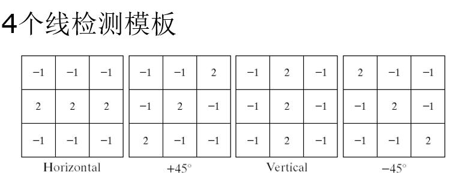

### 锐化：

$$\displaystyle \nabla^2f   =   \frac{\partial^2f}{\partial x^2}+\frac{\partial^2f}{\partial y^2} \\ ={[f(x+1,y)+f(x-1,y)+f(x,y+1)+f(x,y-1)]-4f(x,y)}$$

$$Laplace算子 \Rightarrow \begin{cases} \begin{bmatrix}
1&1&1 \\
1&-8&1\\
1&1&1 \\
\end{bmatrix} & \{f(x,y)-\nabla^2f(x,y)\} \\ \begin{bmatrix}
-1&-1&-1 \\
-1&8&-1\\
-1&-1&-1 \\
\end{bmatrix} & \{f(x,y)+\nabla^2f(x,y)\} \end{cases}$$

$$\nabla f \approx \vert G_x\vert+\vert G_y \vert$$

$$Roberts算子\Rightarrow \nabla f\approx \vert f(x+1,y+1)-f(x,y) \vert + \vert f(x+1,y)-f(x,y+1) \vert \\ G_x \begin{bmatrix}
-1&0\\
0&1\\
\end{bmatrix},\,G_y \begin{bmatrix}
0&-1 \\
1&0\\
\end{bmatrix} $$

$$Prewitt算子\Rightarrow G_x\begin{bmatrix}
-1&-1&-1 \\
0&0&0\\
1&1&1 \\
\end{bmatrix},\, G_y\begin{bmatrix}
-1&0&1 \\
-1&0&1\\
-1&0&1 \\
\end{bmatrix}$$

$$Sobel算子\Rightarrow G_x\begin{bmatrix}
-1&-2&-1 \\
0&0&0\\
1&2&1 \\
\end{bmatrix},\, G_y\begin{bmatrix}
-1&0&1 \\
-2&0&2\\
-1&0&1 \\
\end{bmatrix}$$

 

---

### 频域：

$$\displaystyle F(u)=\frac{1}{M}\sum_{x=0}^{M-1}f(x)(\cos{\frac{2\pi ux}{M}}-j\cdot \sin{\frac{2\pi uy}{M}})=\frac{1}{M}\sum_{x=0}^{M-1}f(x)e^{-j\cdot\frac{2\pi ux}{M}}$$

$$\displaystyle F(u,v)=\frac{1}{MN}\sum_{x=0}^{M-1}\sum_{y=0}^{N-1}f(x,y)e^{-j 2\pi\cdot(\frac{ux}{M}+\frac{vy}{N}) }$$

$$\displaystyle f(x,y)\cdot e^{j2\pi\cdot (\frac{u_0x}{M}+\frac{v_0y}{N})} \Leftrightarrow F(u-u_0,v-v_0)$$
s.t.
$$\displaystyle f(x,y)(-1)^{x+y} \Leftrightarrow F(u-\frac{M}{2},v-\frac{N}{2})$$

 

btw
$$f(ax,by)\Leftrightarrow \frac{1}{\vert ab\vert}F(\frac{u}{a},\frac{v}{b})$$
点源函数的傅里叶频谱是网格状的，当点源的尺寸增大时，根据傅里叶变换的尺度缩放性质判断可知

- [ ] 傅里叶频谱的网格将变稀；
- [x] 傅里叶频谱的网格将变密；
- [x] 傅里叶频谱的网格将变亮；
- [ ] 傅里叶频谱的网格将变暗。

$$D(u,v)=\sqrt{(u-\frac{M}{2})^2+(v-\frac{N}{2})^2}$$

* 理想低通滤波器：尖锐 $H(u,v)=\begin{cases}1 & D(u,v)\leq D_0 \\ 0 & D(u,v)>D_0 \end{cases}$
  振铃现象，Sinc函数 中的涟波
* 巴特沃思低通滤波器：处于理想和高斯低通滤波器之间 
  $$\displaystyle H(u,v)=\frac{1}{1+[\frac{D(u,v)}{D_0}]^{2n}}$$
* 高斯低通滤波器：平滑
  $H(u,v)=e^{-D(u,v)^2/2\sigma^2}=e^{-\frac{D(u,v)^2}{2D_0^2}}$
  没有振铃

高通频域滤波器:=1-低通

同态滤波：f (x,y)=i(x,y)⋅r(x,y)。i(x,y)表示入射光照，r(x,y)表示反射、透射系数。
入射光的动态范围很大(太亮或太暗)但变化缓慢，反射/透射系数变化迅速，决定了图像**细节和局部对比度**
log f (x,y) = logi(x,y)+logr(x,y)
取对数后，图像灰度变化的趋势不变，即logi(x,y) 缓慢变化，分布在低频段， logr(x,y)变化迅速，分布在高频段。

--- 

### 图像退化复原

成像系统镜头聚焦不准产生的散焦 
相机与景物之间的相对运动
射线辐射大气湍流等因素造成的照片畸变
成像系统的像差、畸变、有限带宽等 
图像在成像、采集、数字化和处理过程中引入的噪声

$$G(u,v)=F(u,v)\cdot H(u,v)+N(u,v)$$
h(x,y)表示退化函数的空间描述

只有噪声：
**均值滤波**
算术均值滤波：$\displaystyle f(x,y)=\frac{1}{mn}\sum_{(s,t)\in S_{xy}}g(s,t)$
几何平均滤波：$\displaystyle f(x,y)=[\prod_{(s,t)\in S_{xy}}g(s,t)]^{\frac{1}{mn}}$
谐波均值滤波(不适于椒噪声)：$\displaystyle f(x,y)=\frac{mn}{\sum_{(s,t)\in S_{xy}}\frac{1}{g(s,t)}}$
逆谐波均值滤波：$\displaystyle f(x,y)=\frac{\sum_{(s,t)\in S_{xy}}g(s,t)^{Q+1}}{\sum_{(s,t)\in S_{xy}}g(s,t)^Q} \,\,$，当Q为正数时，用于消除“胡椒”噪声；当Q为负数时，用于消除“盐”噪声，但不能同时消除“椒盐”噪声
**统计排序滤波**
中值、最大值、最小值、中点（（最大+最小）/2）
修正阿尔法均值滤波：
在Sxy邻域内去掉g(s,t)最高灰度值的d/2和最低灰度值的d/2
gr(s,t)代表剩余的mn-d个像素
$$f(x,y)=\frac{1}{mn-d}\sum_{(s,t)\in S_{xy}}g_r(s,t)$$
当d=0，退变为算术均值滤波器
当d=mn-1，退变为中值滤波器
当d取其它值时，适用于包括多种噪声的情况下，例如高斯噪声和椒盐噪声混合的情况

自适应局部噪声消除滤波：$f(x,y)=g(x,y)-\frac{\sigma_n^2}{\sigma_l^2}[g(x,y)-avg]$
自适应中值滤波：
如果窗口较小，则能较好地保护图像中的一些细节信息，但对噪声的过滤效果就会打折扣；反之，如果窗口尺寸较大则会有较好的噪声过滤效果，但也会对图像造成一定的模糊效果，从而丢失一部分细节信息。另外，如果在滤波窗口内的噪声点的个数大于整个窗口内像素的个数，则中值滤波就不能很好的过滤掉噪声。

$z_{min}<z_{med}<z_{max} \Rightarrow z_{min}<z<z_{max} \Rightarrow输出z$
 调整窗口大小，使中值非脉冲，成功转B，否则输出中值 ; B当前像素是否脉冲，不是则值不变，是则输出中值

周期噪声：
带阻滤波器
带通滤波器
陷波滤波器

运动退化模型

$H(u,v)=\int_0^T e^{j2\pi [ux(t)+vy(t)]} dt$

维纳滤波

 

--- 

辐射率：单位时间从光源流出能量的总量，用瓦特(W)度量
光强：单位时间观察者从光源接收能量总和
亮度：主观描绘子
锥细胞对彩色敏感，杆细胞对亮度敏感
色调：彩色的类别
饱和度：指颜色的纯度，可用来区别颜色的深浅程度。混入的白光越少，饱和度越高，颜色越鲜明
亮度：视觉系统对可见物体辐射或者发光多少的感知属性

减色基CMY(青、品红、黄)、CMYK (青、品红、黄、黑），是RGB的补色
HSI：色调、饱和度、亮度
YIQ：Y指亮度(Brightness),即灰度值；I和Q指色调，描述色调及饱和度
YUV：Y指亮度,与YIQ的Y相同；U和V也指色调，不同于YIQ的I和Q
YCbCr：Y指亮度,与YIQ和YUV的Y相同；Cb和Cr由U和V调整得到；JPEG采用的

---

编码冗余：如果一个图像的灰度级/符号编码，使用了多于实际需要的编码长度，就称该图像包含了编码冗余

像素间冗余：对于一幅图像，单个像素对视觉的贡献是冗余的。它的值可以通过与它相邻的像素值为基础进行预测

心理视觉冗余：有些信息在通常的视觉过程中与另外一些信息相比并不那么重要，这些信息被认为是心理视觉冗余的，去除这些信息并不会明显降低图像质量

需要评价信息损失程度的度量方法以描述解码图像相对于原始图像的偏离程度，这些测度称为**保真度准则**
客观保真度准则

* 均方根误差
  
  

* 均方信噪比
  
  

主观保真度准则：肉眼观察

信源熵：$\displaystyle H(z)=-\sum_{j=1}^{J}p(a_j)\log P(a_j)$
无噪声编码定理：编码的平均长度 $L_{avg}$ 与信源的熵 $H(z)$ 存在关系 $L_{avg}\geq
H(z)$
编码效率 $\eta=\frac{H(z)}{L_{avg}}$
压缩率C：原始数据平均比特率n与编码后平均比特率nd之比，无失真编码压缩比上限 $C_{max}=\frac{n}{H(z)}$

无损压缩

* 哈夫曼编码
  符号按照概率大小排列
  对概率最小两符号合并，计算合并后新符号概率并排序
  重复上述步骤，直至剩余符号不多于两个
  
  

* 算术编码
  
  

* LZW编码
  
  

* 位平面编码
  一维游程编码
  
  

* 无损预测编码
  当输入图像的像素序列fn逐个进入编码器，预测器根据过去的输入产生当前输入像素的估计值。预测器的输出舍入成最近的整数$\hat{f_n}$并被用来计算预测误差$e_n=f_n-\hat{f_n}$
  $\hat{f_n}=round(\sum_{i=1}^{m})a_if_{n-i}$
  该误差用符号编码器借助变长码进行编码以产生压缩数据流的下一个元素。然后解码器根据接收到的变长码字重建en，并执行$f_n=e_n+\hat{f_n}$操作

变换编码
1、DFT
2、WHT
3、DCT
DCT在信息压缩能力和计算复杂性之间提供了很好的平衡，因此，许多变换编码系统都是以DCT变换为基础
对比其它方法，DCT变换可以使用单一的集成电路实现，可以用最少的系数包含相同量信息
可使“分块噪声”的块效应最小，这些分块噪声是由子图像之间的可见边界造成的

> 在对每块的DCT 系数进行量化时，是将DCT系数除以量化系数后取整，丢弃一些对图象影响不大的高频分量，达到降低码率的目的。但是，如果量化比较粗糙，会丢失块边缘的大量高频信息，造成重建图象中块的边界处出现不连续的跳变，这就是块效应

### 图像分割

点检测：$\begin{bmatrix}-1&-1&-1 \\ -1 & 8&-1 \\ -1&-1&-1 \end{bmatrix}$

一阶导数可用于检测图像中的一个点是否在边缘上
 二阶导数可以判断一个边缘像素是在边缘亮的一边还是暗的一边
 一条连接二阶导数正值和负值的虚构直线将在边缘中点附近穿过零点 (零交叉)
梯度算子Reborts、Prewitt、Sobel

Canny边缘检测：
基于边缘梯度方向的非极大值抑制，双阈值的滞后阈值处理
二阶微分
拉普拉斯算子、
高斯型拉普拉斯算子LoG算子对图像滤波，等同于先用高斯平滑滤波，再做拉普拉斯滤波

边缘连接
边缘像素梯度算子的响应强度
如果$\vert \nabla f(x,y)-\nabla f(x_0,y_0)\vert\leq E$
则(x,y)邻域内坐标为(x0,y0)的边缘像素，在幅度上相似于(x,y)的像素
边缘像素梯度算子的方向
如果$\vert \alpha(x,y)-\alpha(x_0,y_0)\vert<A,\,\,\alpha(x,y)=\arctan(\frac{G_y}{G_x})$
则(x,y)邻域内坐标为(x0,y0)的边缘像素，在角度上相似于(x,y)的像素

对于任意两点的直线方程：y=ax+ b，有b=-ax+y，从而构造一个参数a，b的平面
参数平面构造hough空间，在参数ab平面上相交直线多的点，对应着xy平面上的一条直线，不过，对于垂直线，斜率为无穷大，在hough空间中无法表达

图像分割
基于门限/阈值的分割方法

* 基本全局阈值算法
  选择一个T的初始估计值
  用T分割图像，生成两组像素：G1由所有灰度值大于T的像素组成，而G2由所有灰度值小于或等于T的像素组成
  对区域G1和G2中的所有像素计算平均灰度值μ1和μ2
  计算新的阈值$T=\frac{\mu_1+\mu_2}{2}$
  重复步骤2到4，直到逐次迭代所得的T值之差小于事先定义的门限ΔT
* 最大类间方差法 (OTSU)
  
  图像分块局部阈值

基于区域的分割方法
从区域着手顺序的进行分析
好处：抗噪声、抗干扰
坏处：复杂、耗时

区域生长、区域分裂与合并

基于形态学分水岭的分割方法

### 表示与描述

表示是直接具体地表示目标。好的表示方法应具有节省存储空间、易于特征计算等优点
描述是较抽象地表示目标。尽可能区别不同目标；对目标的尺度、平移、旋转等不敏感
链码：4-链码，8-链码

起点归一化(选择起点的方法)
将链码看作由方向数构成的自然数选取值最小的自然数顺序
原链码：
1  0  1  0  3  3  2  2  
归一化链码：
0  1  0  3  3  2  2  1

旋转归一化
旋转前后的边界链码起点需选择相同点
计算差分:相邻两个元素**逆时针**方向变化的数字

